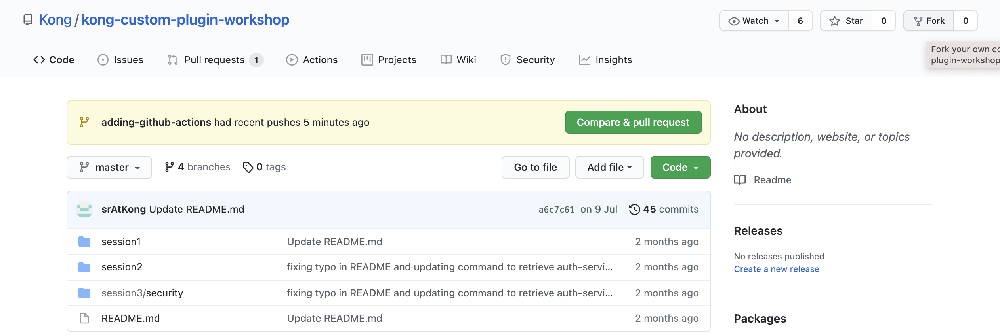
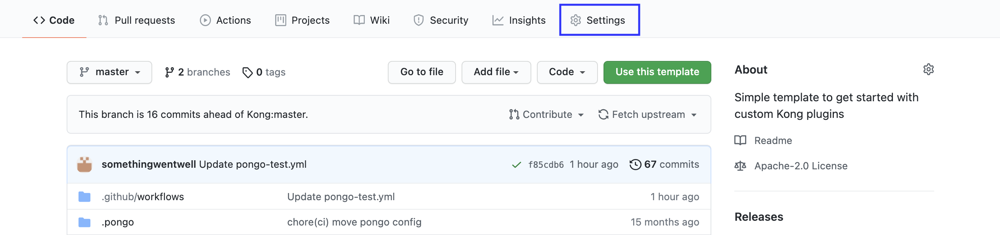
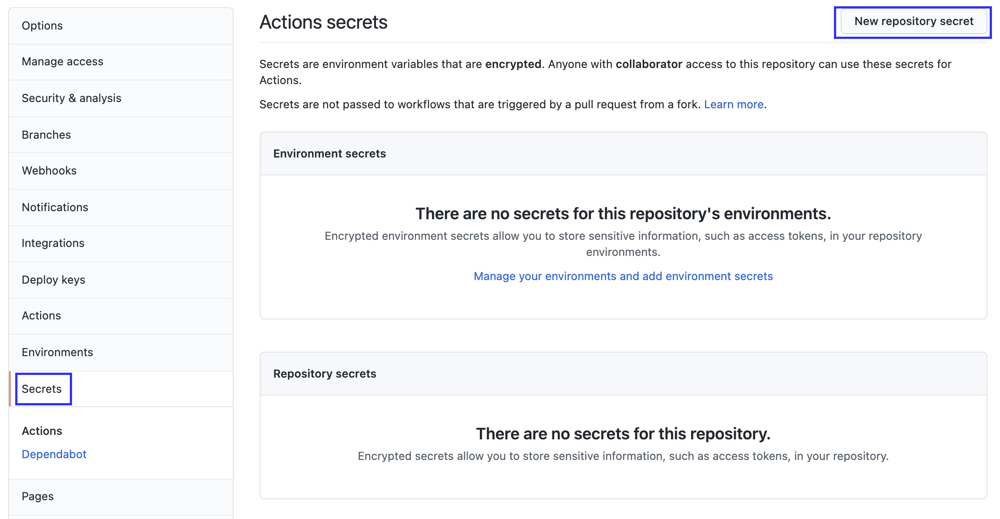
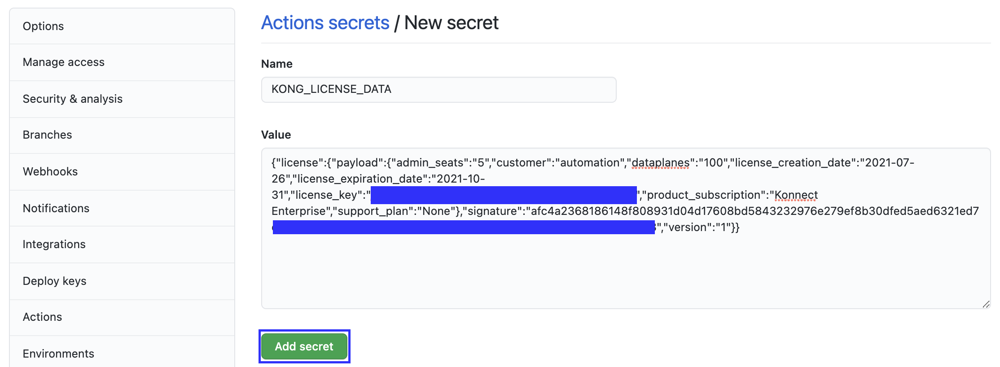
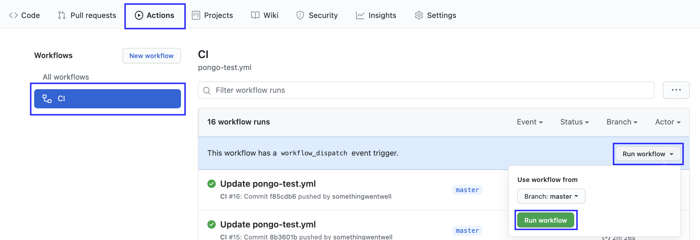
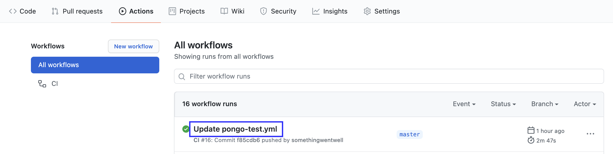
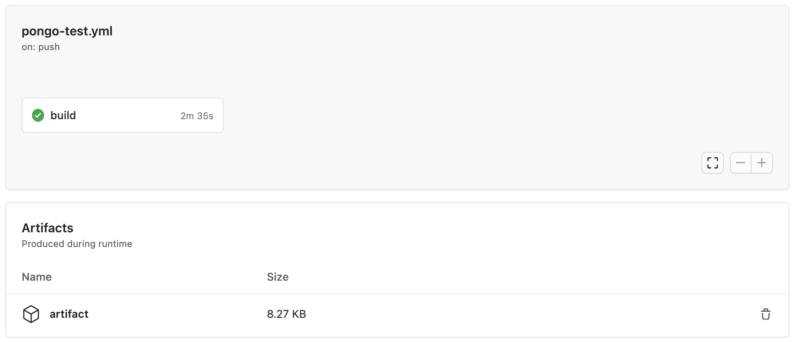
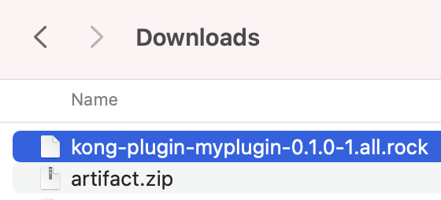

## Introduction

This lab will create a Github Actions workflow to test custom plugin in CI pipeline and build luarock binary and upload to GitHub Artifacts automatically.

## Fork the repo

Click "Fork" in top right corner of this repo

## Add license data as GitHub secret (Optional)

Click "Setting" in your forked repo

Click "Secrets" in sidebar then click "New repository secret"

Put name as "KONG_LICENSE_DATA" and value as your own license data. Then click "Add secret"

Comment line 17 and uncomment line 18 & 19.

## Run workflow

For running workflow manually, click "Action" tab, then select "CI" under all workflows, after that click "Run workflow"

Or push and commit to master branch for running workflow automatically.

## Review result

After the pipeline runs, click into it.

There should have an artifact, download it.

Unzip the downloaded zip file, you should see the rock binary file.
